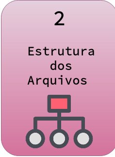
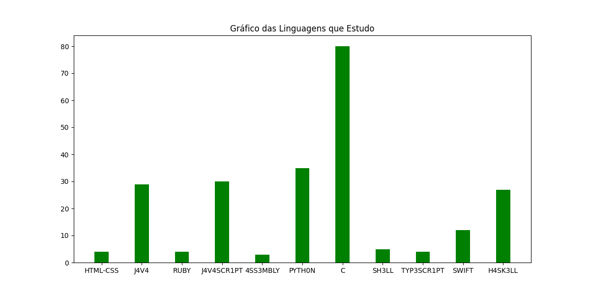
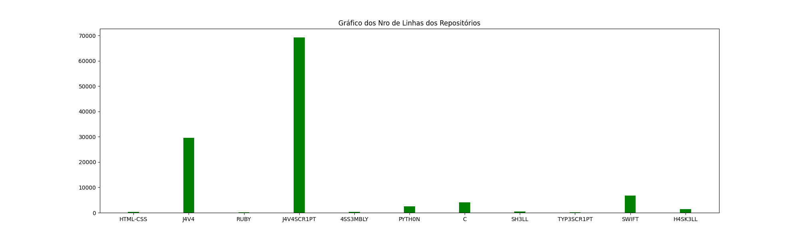

<h3>HackaBOT </h3>

---

### Links para a Documentação

<table>
<tr>
<tr><td>

[](https://github.com/F4NT0/catchCommit/wiki/configuracao_dependencias)

</td><td>

[](https://github.com/F4NT0/catchCommit/wiki/estrutura_arquivos)

</td><td>

[](https://github.com/F4NT0/catchCommit/wiki/criacao_bot)

</td><td>

[](https://github.com/F4NT0/catchCommit/wiki/codigo-compilacao)

</td>
</table>

### Importante

1. **Para o BOT funcionar ele deve ser adicionado ao seu Servidor**
2. **Tenha em mãos o TOKEN do seu BOT e não o passe para ninguem e nem coloque no seu código público**
3. **Tenha o ID do Canal que deseja vincular o BOT**
4. **Quando for usar o Github, cuidado com seus dados de autenticação, não os coloque direto no código publico**

### Descrição do BOT

* Quando for fazer uma Hackatona, crie uma Organização para ter salvo todos os Repositórios que foram criados durante a hacka
* Crie um Arquivo chamado **auth.txt** dentro do diretorio **info** com os dados sigilosos necessários para o BOT, esses dados não irão ser enviados ao Repositório na seguinte estrutura:

```
usuario:
senha:
organizacao:
titulo:
nome:
cor:
canal:
token:
```
**OBS: Todos os Dados devem ser colocados sem espaços entre os :**

Dado|Para que Serve|Exemplo
|---|---|---|
`usuario`|Coloque o nome do Usuário|_usuario:F4NT0_
`senha`|Coloque a Senha do Usuário|_senha:12345678_
`organizacao`|Coloque o nome da Organização desejada|_organizacao:fantolanguages_
`titulo`| Este vai ser o Título do Gráfico|_titulo:Gráfico Interessante_
`nome`|Este vai ser o nome do Arquivo gerado em PNG|_nome:Imagem_
`cor`|Este vai ser a Cor do Gráfico, sendo uma Cor Geral, se quiser cores individuais terá que colocar manualmente cada uma|_cor:green_ (nome deve ser em ingles)
`canal`|Aqui se coloca o ID do Canal onde o BOT vai enviar os Dados no Discord|_canal:12345678_
`token`|Aqui se coloca o TOKEN secreto do BOT,onde vai ser usado para confirmar a ação de envio|_token:agyagdu2t82g2d7t_


**Exemplo de Gráficos Criados**

---



---



---
